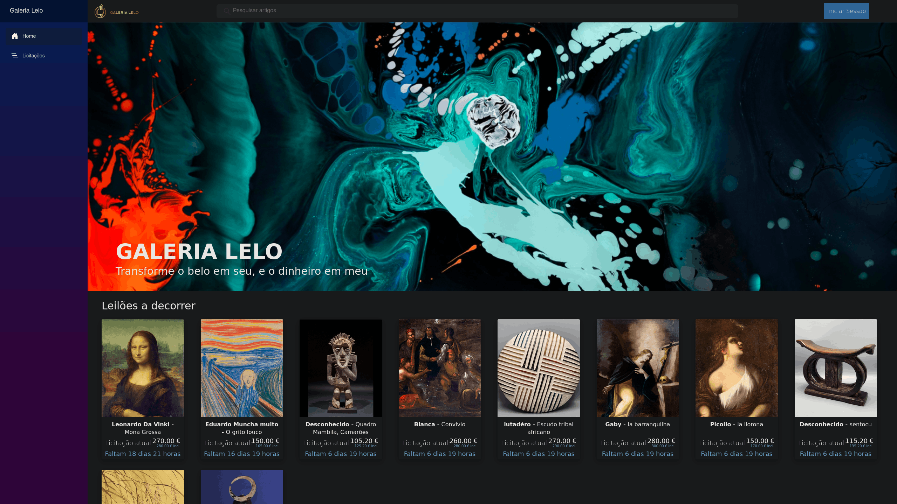
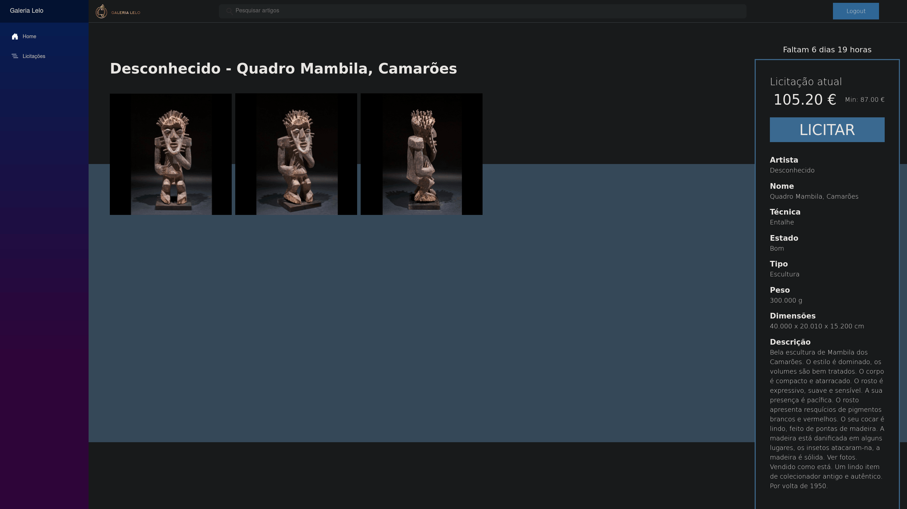
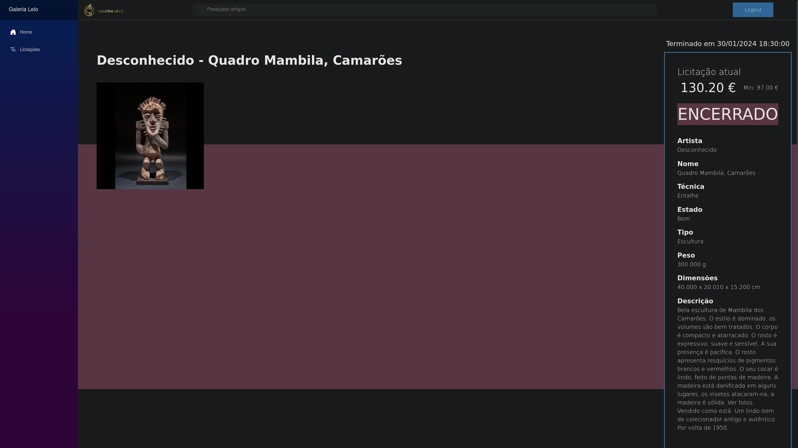
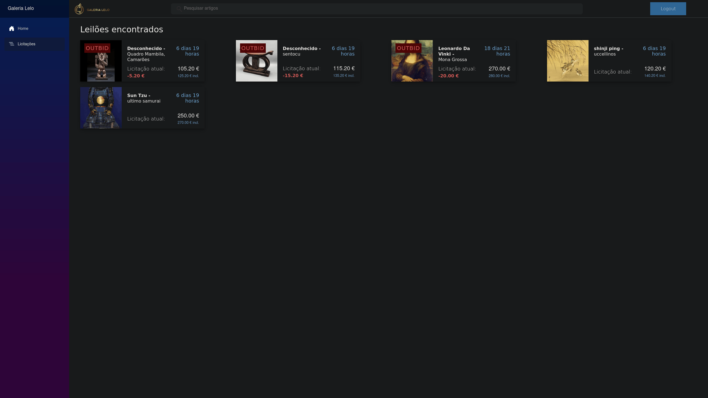
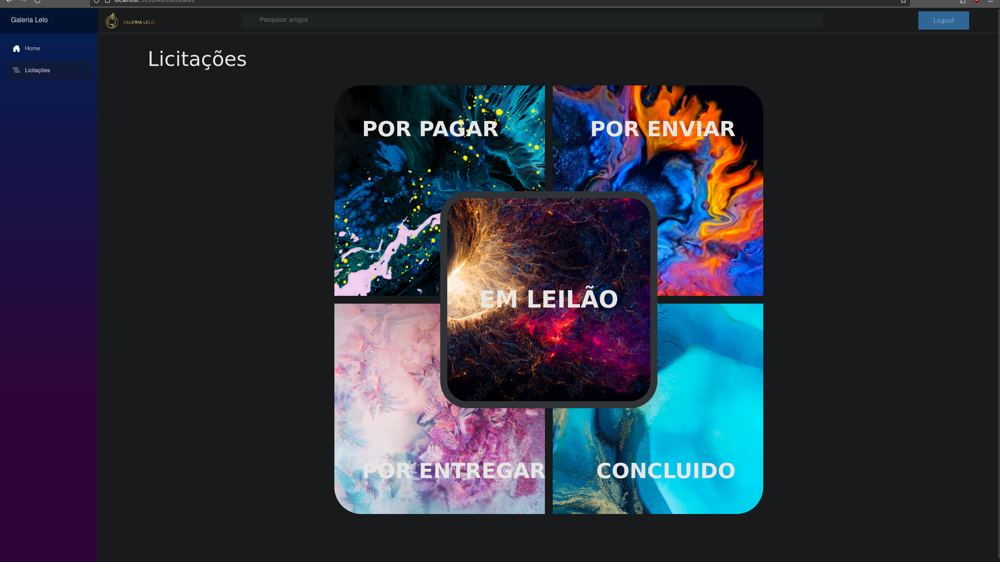
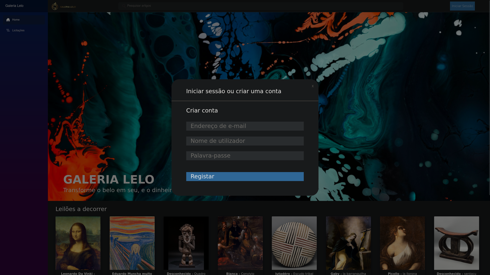
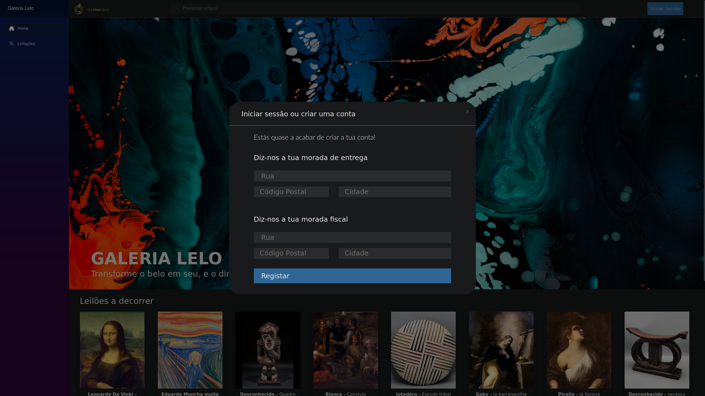
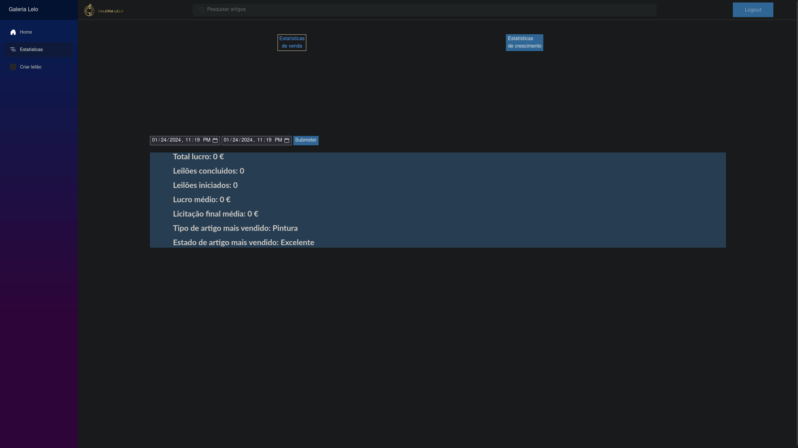

# 🎨 Art Auction Platform



## 1. Overview

This project implements a **full-stack art auction platform**, allowing users to browse and search active auctions, place bids, and track their bidding history, while administrators can create and manage auctions, monitor sales, and access platform statistics.

The application was developed using **C# and .NET 8 with Blazor's Interactive Server rendering model**, with data persisted using **Microsoft SQL Server**, as part of a university course project.
The project only runs **locally** and does not include Docker or external deployment configuration.

The purpose of the project was to learn and practice the main stages of the **software development lifecycle**, following a **waterfall methodology**: 
- **System Definition**: Defined the project context, motivation, objectives, viability, required resources, team organization, and development schedule.
- **Requirements Definition**: Established a requirements acquisition strategy, defined user scenarios, and specified functional and non-functional requirements.
- **Software Modelation & Specification**: Developed domain and use-case models to represent the system's entities, actors, functionality, and interactions.
- **Data System Design**: Designed the relational data model and database schema supporting users, administrators, auctions, bids, sessions, and artwork information.
- **Interface Design**: Designed the application's navigation and interface flow, supported by UI mockups created in Figma.
- **Implementation**: Developed the application structure, separated domain classes, data access services, and frontend components, and implemented the main user and administrator workflows.
- **Validation & Testing**: Functionality was tested incrementally during implementation rather than through a separate testing phase, due to project time constraints.
- **Maintenance**: Not covered as part of the project scope.

The problem context, requirements, users, and client needse were made up to simulate a real-world problem. 

The complete development process and model schemas are documented in the project report, referenced in the "Documentation" section of this README.

---

## 2. Main Features

### 2.1. User

- Browse active auctions
- Search for ongoing auctions
- View detailed auction and artwork information
- Place and update bids
- Track bidding history across different auction states
- Identify auctions where the user has been outbid
- Rudimentary user registration and credential-based login

### 2.2. Administrator

- Create new auctions and associated artwork
- Search and view auctions
- Manage auction and delivery states
- Consult sales history by auction status
- Access sales and platform growth statistics
- Rudimentary administrator credential-based login

### 2.3. Auction Management

- Minimum bid and auction duration
- Multiple bids per auction and per user
- Multiple concurrent auctions
- Automatic winner determination based on the highest bid on auction end
- Auctions progress through the following states:
  `In Auction → Awaiting Payment → Awaiting Shipment → In Transit → Completed`

---

## 3. Architecture

The application is organized into three main components:

- **`classes/`** — Domain classes representing users, administrators, auctions, bids, and other system entities.
- **`datalayer/`** — Data access services responsible for interacting with the SQL Server database, integrated through dependency injection.
- **`app/`** — frontend Blazor/Razor pages and reusable UI components, including auction cards, layouts, search, authentication, auction details, user bidding history, administrator sales, and statistics.

The application separates presentation, application/domain logic, and data access, with the data layer handling communication with the relational database independently from the UI components.

---

## 4. Setup

### Requirements
Before starting, make sure that:

- **.NET 8 SDK** is installed.
- **Microsoft SQL Server** is installed and running.

### Database setup
Setup connection and database:
1. update the connection string in [app/appsettings.json](app/appsettings.json) to point to your SQL Server instance, replacing the ``password_here`` placeholder with the appropriate database credentials.
2. Open the provided SQL scripts in SQL Server Management Studio (SSMS) or another SQL Server client.
3. Execute the scripts in the following order:

    * [SQL_CreateSchema.sql](sql/SQL_CreateSchema.sql) — Creates the database schema and tables.
    * [SQL_createUser.sql](sql/SQL_createUser.sql) — Creates the predefined users and administrators.
    * [SQL_Indexes.sql](sql/SQL_Indexes.sql) — Creates the database indexes.
    * [SQL_Population.sql](sql/SQL_Population.sql) — Populates the database with sample auction and application data.
    * [SQL_Procedures_and_Funcs.sql](sql/SQL_Procedures_and_Funcs.sql) — Creates the stored procedures and functions used by the application.
    * [SQL_UpdateAuctions.sql](sql/SQL_UpdateAuctions.sql) — Creates the database logic used to update auction states.

After the database has been configured, start the application from the ``app/`` directory:

```bash
dotnet run

# or, during development:
# dotnet watch
```

The application can then be accessed through the local address provided by the .NET development server.

---

# 5. Website Screenshots (dark mode)

*Home Page Screenshot*


*Item Page Screenshot - Ongoing auction*


*Item Page Screenshot - Finished auction*



*Bids Page Screenshot - Ongoing auction*


*Bid Type Selection Page Screenshot*


*Login Modal Screenshot*


*Register Modal Screenshot - 1st section*


*Register Modal Screenshot - 2nd section*


*Admin Dashboard Screenshot*


---

# 6. Documentation

* Project Report: [Galeria Lelo Report](repo_description/report.pdf)
* Presentation Deck: [Galeria Lelo Presentation](repo_description/presentation.pdf)
* Figma UI Mockups: [Figma UI Mockups](https://www.figma.com/design/6TiVVrgYxVS5dgtatf3tLO/Mockups-LI4?node-id=0-1&t=jPh50GPfLyWG8PPC-1)
* UI Mockups (PDF): [UI Mockups](repo_description/ui_Mockups.pdf)
---

# 7. Authors

* **Ivan Sérgio Rocha Ribeiro** ([GitHub](https://github.com/IVSOP))
* **Pedro Miguel Meruge Ferreira** ([GitHub](https://github.com/pedromeruge))
* **Ricardo José Santos Veloso** ([GitHub](https://github.com/RicardoVeloso24))

Computer Labs IV Project — University of Minho, 2023/2024